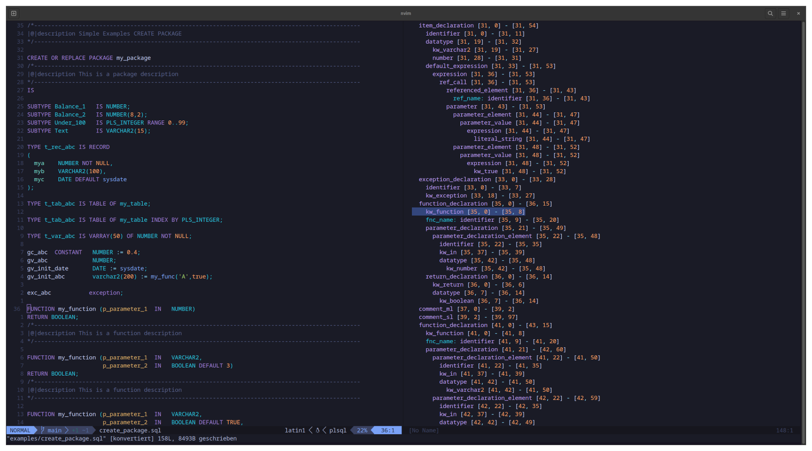

# tree-sitter-plsql

> **Provenance (fork):** forked from <https://github.com/AndreasMaierDe/tree-sitter-plsql>
> (commit `28aebef`, 2023-02-18).
> **Changes vs upstream:** Rust binding modernized to the `tree-sitter-language`
> `LanguageFn` API (`pub const LANGUAGE`); `tree-sitter` moved to a dev-dependency;
> `parser.c` regenerated with tree-sitter-cli 0.25.10 (ABI 13 -> 15); added a minimal
> `tree-sitter.json` (required by the 0.25 CLI to emit ABI 15); added a synthetic
> smoke-test corpus (`test/corpus_smoke/`) and `tests/smoke.rs`.
> One grammar fix in `grammar.js`: `create_procedure` / `create_function` required a
> second `end_obj_named` after `body` (which already consumes `END name;`), so a plain
> standalone `CREATE [OR REPLACE] PROCEDURE/FUNCTION ... END;` could never parse; the
> trailing `end_obj_named` was moved into the `call_spec_ext` branch only. No other
> grammar-rule changes.
> **Known gaps (inherited from upstream, not fixed here):** multi-event DML triggers
> (`BEFORE INSERT OR UPDATE ON t` — `dml_event_clause` accepts a single event only);
> field access on bind variables (`:new.col` / `:old.col` in row triggers); collection
> element as assignment target (`l_tab(i) := x;` — indexed reads parse fine);
> cursor FOR loops over inline subqueries (`FOR r IN (SELECT ...) LOOP`).
> **Rebase policy:** binding-only diff plus the one-line grammar fix above, rebased onto
> upstream when it moves; retired if upstream ships an equivalent 0.25 binding.
> **Upstream PR:** pending (link will be added here once opened).

Oracle pl/sql grammar for tree-sitter

As oracle database developer you very often switch between pl/sql and sql elements. This grammar try to support the (most used) language elements from both worlds.
A few sqlplus commands will also be supported

# Status
It's in development and some (or many -> oracle syntax is huge) statements are missing or must optimized, but I use it at my daily job for syntax highlighting in neovim and it works in this files realy good.

This Oracle statements are at the moment supported:
- alter [package|function|procedure|library|type|trigger]
- create [package|function|procedure|library|type|type_body|trigger]
- drop [package|function|procedure|library|type|type_body|trigger]
- sql [select|update|delete|insert|merge]

# References
* [Database PL/SQL Language Reference](https://docs.oracle.com/en/database/oracle/oracle-database/21/lnpls/index.html)
* [SQL Language Reference](https://docs.oracle.com/en/database/oracle/oracle-database/21/lnpls/index.html)

## Maintenance & support

This grammar is a **fork maintained for our own use, provided as-is, with no support and no SLA.**
We are **not responsible for its ongoing maintenance.** Issues may go unanswered; pull requests
are welcome but are not guaranteed to be reviewed or merged. The upstream project (see the
provenance header above) is the canonical source — please prefer contributing fixes there.
